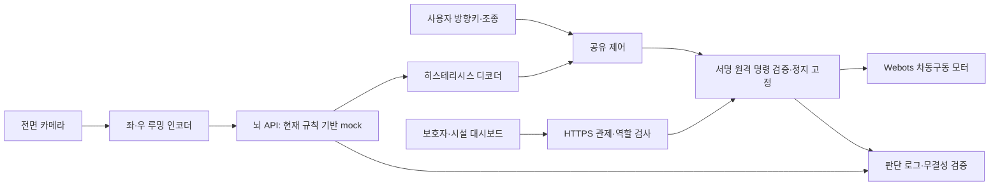

# ReflexGuard 서비스 개요서 초안 — 0.5.0

작성 기준: 2026-09-24 구현과 검증 기록. 대회 공식 제출 양식을 받은 뒤 항목·분량을 맞춰야 하며, 아래 내용은 현재 프로젝트에 대한 초안이다. 출품 자격·AI 도구 허용 여부·공식 심사 기준 확인 완료를 뜻하지 않는다.

## 목적과 사용자

ReflexGuard는 초파리 신경회로에서 배운 충돌 회피 기술을 활용하는 생체모방 안전 보조 프로젝트다. 전동휠체어 사용자의 조종을 기본으로 두고 위험 신호가 커지면 정지 또는 제한된 회피 조향을 더하는 공유 제어를 목표로 한다.

사용자는 휠체어 탑승자, 지정 휠체어의 상태를 확인하고 원격 정지를 요청하는 보호자, 시설 내 속도 정책과 실험용 뉴런 침묵을 다루는 운영자, 계정·보호자 연결을 관리하는 관리자다. 현재 결과는 Webots 개발 시뮬레이션이며 실제 사용자 탑승이나 의료·안전 인증을 거친 서비스가 아니다.

## 구성과 동작

전면 160×120 카메라의 연속 프레임에서 좌우의 어두운 물체 면적 확장을 구하고 지수이동평균으로 노이즈를 줄인다. 뇌 API는 escape/turn과 상위 뉴런 정보를 반환한다. 디코더와 공유 제어기는 정지/조향을 적용하며 위험 해제와 중립 입력 조건으로 떨림·갑작스러운 재출발을 줄인다. 뇌 통신 실패 시 감속 후 정지하고, 관제 연결이 설정된 경우 관제 오류·원격 정지는 정지 상태로 고정한다.

뇌 API 계약은 mock과 향후 실제 모델이 공유한다. 기준 데이터는 MaleCNS v1.0이지만 현재 데이터·가중치를 내려받아 실행하는 단계는 완료하지 않았다. 현재 화면의 `mock-rules-v1` 발화는 규칙 기반 가상 뉴런 출력이다. 실데이터 결과로 표현하지 않는다.

## 개발 스택과 보안 적용

Python 3.10, FastAPI·Jinja2·SQLAlchemy·SQLite, HTTPX, OpenCV·NumPy, Webots R2025a를 사용한다. JavaScript는 폼 요청·상태 표시·새로고침에 한정한다.

| 보안 목적 | 적용 내용 | 확인 자료 |
|---|---|---|
| 사용자/장치 구분 | bcrypt 로그인·잠금, 세션/CSRF, 역할·휠체어 소유권, 장치 토큰 | KISA 매핑 K05/K08/K09/K19/K26 |
| 원격 제어 변조·재전송 방지 | stop/speed_limit만 허용, HMAC-SHA256·대상·boot ID·nonce·±2초 | Phase 4 HTTPS→Webots 통합 결과 |
| 뇌 서비스 신뢰 | mTLS+Bearer, CA·호스트 검증, 200ms 전체 응답 제한 | 실제 TLS 계약·단절 시험 |
| 입력/웹/DB 보호 | Pydantic 범위 검증, SQL 바인딩, 템플릿 이스케이프, 일반 오류 응답 | KISA 매핑 K01/K03/K07/K22 |
| 판단 근거 추적 | 시각·루밍·발화·명령 기록, 해시 체인·HMAC·말단 검증, 권한별 내보내기 | 체인 변조·동시 기록 테스트 |
| 배포 추적 | 버전/해시 고정, 스캐너·테스트 게이트, Python 환경 SBOM | sbom.json·sbom_provenance.json·검증 로그 |

## 시연 결과와 제한

- Phase 3의 복도 3종 최종 각 10초 시험에서 충돌 0회. 무조작 시험에서는 위험 신호가 커져도 자율 이동을 만들지 않았다. 임계값과 보정 중 실패 사례도 [보정 기록](calibration.md)에 남겼다.
- Phase 4 실제 HTTPS 관제 통합 시험: 약 0.33m 주행 후 원격 정지, 최종 모터 출력 0, 충돌 0회, 감사 체인 검증 통과. [시험 원문](logs/phase4-control.json).
- 0.4.1에서는 실제 로컬 admin 로그인/대시보드 HTTP 200을 확인하고 212개 테스트·보안 게이트를 통과했다. 0.5.0 검증은 [Phase 5 기록](phase5.md)에 별도로 기록한다.
- 이는 제한된 시뮬레이션 조건의 결과다. 영상 방식은 조명 변화·밝은 장애물·좌우 경계 이동에 약하며 실제 TTC 추정이나 하드웨어 안전을 보장하지 않는다. Webots와 실제 물리 시간 차이, 장기 운전·부하·실제 장비 검증이 남아 있다.

[위협 모델](threat_model.md)의 잔여 위험을 포함해 제출 전 개선 범위를 검토한다. HMAC은 공개키 전자서명이나 독립 부인방지를 제공하지 않고, 로컬 로그 체인은 외부 checkpoint 없이 전체 DB rollback을 탐지하지 못한다.

## 다음 구현

Phase 6은 외부 GPU 장비에서 실제 MaleCNS 자료의 출처·스키마·무결성을 검증하고 후보 회로를 선정하여 LIF API를 구현하는 단계다. 모델 자산 서명·자원 한도·성능·동일 계약 시험 및 Webots 재보정이 필요하다. Phase 7 통합 리허설과 Phase 8 별도 시연 Lab은 아직 완료하지 않았다.
