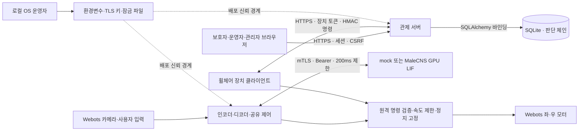

# ReflexGuard 위협 모델 — 0.7.0

검토일: 2026-09-25. 범위는 Ubuntu VM의 mock·Webots·HTTPS 관제, 서명된 MaleCNS 축소 LIF와 Thor GPU 배포다. 실물 휠체어와 Attack Lab은 포함하지 않는다. 보안 검사 통과는 위협이 모두 제거됐다는 뜻이 아니다.

## 자산·주체·신뢰 경계

| 자산 | 보호 목적 |
|---|---|
| 최종 좌/우 모터 명령, 정지 고정 상태 | 잘못된 입력·인증 실패가 이동 명령으로 이어지지 않도록 보호 |
| 비밀번호 해시, 세션, 장치/뇌 토큰, 원격 HMAC·감사 키, TLS 개인키 | 다른 사용자·장치의 권한 행사와 기록 위조 방지 |
| 카메라 프레임, 루밍·발화·판단·원격 명령 기록 | 변조/재전송 구분, 권한별 열람, 문제 재현 |
| 코드, requirements 잠금, 배포 자산, SBOM | 어떤 소프트웨어를 검증했는지 추적 |

주체는 보호자(guardian), 운영자(operator), 관리자(admin), 인증된 휠체어 장치, 인증된 뇌 클라이언트, 익명 네트워크/브라우저 요청자, 로컬 OS 운영자다. 동일 OS 계정이 `.env`·개인키·DB를 모두 읽고 수정할 수 있는 상황을 원격 인증만으로 방어한다고 가정하지 않는다.

0.8.2 VM 관제는 0.0.0.0:8444로 LAN에 공개하고 HTTPS·고정 Host/Origin·인증·RBAC·CSRF·로그인 제한을 유지한다. mock/로컬 뇌는 127.0.0.1, GPU 뇌는 internal Docker 주소로 제한한다. 관제용 IP SAN 인증서는 뇌 mTLS와 분리한다. 개발 CA를 사용하는 LAN 시연 구성으로 공인 인터넷 운영 배포는 아니다. 브라우저/장치의 HTTPS와 뇌 API의 필수 mTLS를 구분한다. Webots 접촉 센서는 결과 측정용이고 회피 파이프라인의 입력으로 사용하지 않는다.

## 구성요소별 STRIDE

S=신원 위조, T=변조, R=행위 부인, I=정보 노출, D=서비스 거부, E=권한 상승. 각 셀의 화살표 뒤는 현재 대응 또는 남은 작업이다.

| 구성요소 | S | T | R | I | D | E |
|---|---|---|---|---|---|---|
| 브라우저·로그인·세션 | 계정/쿠키 탈취 → bcrypt·무작위 세션·만료 | CSRF/XSS → Origin·CSRF·자동 이스케이프·CSP | 로그인/사용자 관리의 완전한 감사 이벤트는 미구현 | Secure/HttpOnly·일반 오류, 로컬 브라우저 침해는 잔여 | 로그인 잠금·IP 한도, 잠금 유발·분산 요청은 잔여 | 역할은 DB에서 조회, 보호자 범위 검사, 세션 폐기 |
| 관제 API·DB·내보내기 | 장치 토큰을 휠체어 ID와 결합 | SQL 바인딩·sequence·해시 체인/HMAC | 명령 요청·적용 기록, 독립 제3자 부인방지 아님 | ID별 권한 확인, 파일 경로 미수용; DB 저장 암호화 미구현 | SQLite 직렬화·본문 크기 한도; 긴 업로드·로그 증가/내보내기 제한 미흡 | 원격 행동은 stop/speed_limit, 관리자 기능은 별도 역할 |
| 휠체어 장치·모터 | TLS 서버 검증·장치별 HMAC 키 | 대상·boot ID·±2초·nonce 검사 | 적용 nonce와 최종 출력 기록 | 장치별 자격증명 분리 필요, 로컬 데모는 단일 신뢰 호스트 | 관제 오류는 정지 고정; 네트워크 DoS가 운행 중단 가능 | 원격 명령은 운전 시작/정지 해제 불가, 침묵은 운영자 요청 |
| 뇌 API·mock/LIF 세션 | 실행기의 mTLS와 별도 Bearer 토큰 | Pydantic·t_ms 단조 증가·침묵 허용목록 | 모델 버전·발화 기록; MaleCNS 주석/출처·서명 manifest 근거 | 세션 소유권·일반 오류·토큰 비노출 | 세션 수/수명, 요청 1초·16KiB, 클라이언트 총 200ms 제한 | 역할과 세션 소유자를 함께 확인 |
| 영상·인코더·공유 제어 | 현재 카메라는 로컬 시뮬레이터 신뢰 입력; 물리적 영상 교란 방어 없음 | 프레임 크기·시간·유한값 확인; 장면 조작은 감지 보장 못함 | 루밍/뉴런/결정 기록, 원본 영상은 보관하지 않아 재구성 제한 | 현재 영상은 저장·전송하지 않음; 판단 기록 보유 정책 필요 | 영상·뇌 오류는 정지; 실물 하드 실시간 제동 시험 없음 | 사용자의 중립 입력에 자율 이동을 생성하지 않고 정지/조향 한도 적용 |
| 로컬 배포·공급망 | 운영자/패키지 공급자 신뢰 필요 | 버전·해시 잠금·스캐너·SBOM; 모델/침묵 목록 Ed25519 서명·SHA-256 검증 | Git 커밋·검증 로그·SBOM 입력 해시, 서명 릴리스는 미구현 | Git 제외·파일 0600; 호스트/백업/이미 공유된 비밀 관리 필요 | 잘못된 설정·만료 인증서는 운행 중단; 복구 절차 문서화 | 관리자 복구는 로컬 파일/DB 권한을 가진 운영자 전용, 웹 기능 아님 |

## 공격 경로와 검증 근거

| 경로 | 차단/감지 지점 | 주요 동작 시험 |
|---|---|---|
| 보호자가 다른 휠체어를 조회·정지 | `chair_for` 서버 소유권 | `test_guardian_scope_and_remote_roles` |
| 운영자 권한 없이 침묵/속도 제한 호출 | 역할 검사와 뇌 허용목록 | `test_operator_silence_and_pending_stop_priority`, `test_silence_role_permissions` |
| 원격 명령 본문 수정·재전송·지난 부팅 재사용 | `RemoteGuard.accept` | `test_remote_forgery_and_replay`, `test_expired_remote_fails_closed` |
| 다른 CA/호스트의 뇌 서버로 연결 | SSLContext·호스트 이름 | `test_foreign_server_ca_is_rejected`, `test_hostname_verification_is_enabled` |
| DB 판단 수정·말단 삭제·공격자 해시 재계산 | 체인/HMAC/말단 개수 | `test_audit_tampering` |
| 동시 판단으로 체인 분기·중복 sequence | 단일 DB 트랜잭션 | `test_concurrent_audit_append`, `test_device_token_binding_and_sequence` |
| 네트워크 단절 중 이전 속도로 계속 주행 | 뇌/관제 실패 고정 | `test_real_mtls_disconnect_causes_latched_gradual_stop`, `test_poll_failure_stops_and_latches` |
| 초기 계정 파일 수정으로 권한 우회 | DB 해시 검증, 로컬 복구 역할 제한 | `test_admin_recovery_cannot_promote_guardian` |

파일 경로와 테스트 전체 이름은 [KISA 매핑](kisa_mapping.md)에 기록했다. 검증은 단위·실제 TLS·Webots 통합으로 구분하며, 브라우저의 실제 클릭이나 실제 하드웨어 제동까지 자동 검증했다고 주장하지 않는다.

## 잔여 위험과 후속 조건

| 우선순위 | 남은 위험 | 이후 조치 / 완료 확인 |
|---|---|---|
| 높음: 실제 장비 전 필수 | HTTP 호출 중 Webots 시뮬레이션 시간이 멈추므로 실제 제어 주기/제동 거리 보장 없음 | 제어·통신 루프 분리, watchdog, 실제 장비 지연·제동 시험 |
| 높음: 네트워크 운영 전 | 관제 `Boundary` 본문 수신에 전체 타임아웃 없음; SQLite 전역 쓰기 잠금에서 bcrypt 계산 | 수신 deadline·인증 전 자원 한도, 로그인 부하/느린 본문 시험, 트랜잭션 경합 개선 |
| 높음: 운영 데이터 증가 전 | 로그/내보내기 무제한, 검증 시 전 체인 읽음 | 페이지·보유량·크기 한도, 보관/삭제 정책과 체인 checkpoint 설계 |
| 높음: 장비 분리 전 | 로컬 데모 `.env.control`에 서버/장치 키가 함께 있음 | 서버 감사 키와 각 장치 키 분리, 회전·폐기·최소 권한 배포 검증 |
| 중간 | 전체 DB를 유효한 과거 스냅샷으로 되돌리거나 감사 키까지 탈취하면 로컬 체인만으로 탐지 못함 | 외부 append-only checkpoint와 키 격리; rollback 시험 |
| 중간 | 파일/DB 평문 저장, 브라우저/OS 침해, 원격 정지 DoS·시계 이동 | 호스트/디스크·시간 동기화·관제 복구 정책, 침해 및 가용성 리허설 |
| 중간 | 긴 반복 비밀번호 수용, MFA·유출 목록 검사 없음, 일부 관리 행위 감사 누락 | 계정 정책·MFA·관리 감사 이벤트와 회귀 시험 |
| 모델 후속 검증 | 축소 회로·파라미터·좌우 정책의 생리학적 타당성, 공유 GPU 지연 변동 | 개별 수용장/실험 근거·장기 부하·watchdog 검증 |

이 표는 남은 일을 숨기지 않기 위한 개발 목록이다. 순위는 현재 팀의 정성 평가이며 대회 공식 취약점 점수나 의학적 위험 등급이 아니다.

## GPU 모델 배포 경계

- S/T: mTLS와 Bearer를 모두 요구한다. 신뢰 공개키는 자산과 분리해 환경으로 배포하고 Ed25519 서명·가중치/침묵 SHA-256을 확인한다. read_bounded는 symlink를 거부하며 검증한 같은 bytes를 파싱한다. 서명 개인키와 CA 개인키는 GPU에 없다.
- R/I: 모델 버전·가중치 SHA·선정 ID·변환 기록을 남긴다. 원본 공급자 서명이나 모델의 과학적 타당성을 보증하지 않는다. 토큰/키는 로그·오류 응답에 넣지 않는다.
- D: 16세션·TTL900초·4요청·단일 GPU worker·20ms 큐·150ms 시뮬레이션 한도, 크기/NPY shape 한도와 컨테이너 제한을 둔다. GPU 드라이버 정지/공유 GPU 경합까지 선점하지 못한다. timeout에서는 부분 상태를 반영하지 않고 서비스와 제어기를 실패 상태로 둔다.
- E: 침묵은 operator 이상이며 서명된 선택 ID 최대 10개로 한정한다. 출력 뉴런 침묵은 보조를 약화시키므로 시뮬레이션 실험에 한정한다. 기존 호스트 vLLM 등은 변경하지 않는다.

실제 기본 이미지 전체 OS/vendor 라이브러리 감사, 서명키 자동 회전, 인증서 자동 폐기 조회는 미구현이다. 데이터 서명은 배포자가 승인한 파생물의 무결성을 의미하며 센서 교란 방어나 안전 인증을 대체하지 않는다.
